# PlanPal

Forget about tracking your event guestlist using a spreadsheet. With PlanPal, you can host multiple events and manage the RSVP all in one place.

## Getting Started

This is a PERN-stack application, using PostgreSQL and pg-admin as a driver.

### Backend Configuration

Go to the project backend folder and create a new package.json file

`npm init -y`

Install the packages:

`npm i dotenv express-validator jsonwebtoken bcrypt uuid cors helmet express-rate-limit`

For postgresql database, install the following:
`npm i pg-admin`

Create your .env and add the database path (like below for localhost)

`pguser=<YOUR_PGADMIN_USERNAME>` 
`pgpassword=<YOUR_PGADMIN_PASSWORD>` 
`host_name='localhost'` 
`port=5432,` 
`db_name='planpal',` 
`ACCESS_SECRET=<YOUR_ACCESS_SECRET>` 
`REFRESH_SECRET=<YOUR_REFRESH_SECRET>` 

NOTE: The ACCESS and REFRESH secrets were generated using https://www.random.org/strings/

### Frontend Configuration

Create .env file and add the following:

`VITE_SERVER=http://localhost:5001`

Install the packages:

Go to the project frontend folder and install react-app:  `npm i`

Install react-router-dom:
  `npm install react-router-dom`

Install react-pro-sidebar:  
`npm install react-pro-sidebar`

Install jwt-decode:  `npm i jwt-decode`

## App Features

### Main Landing Page

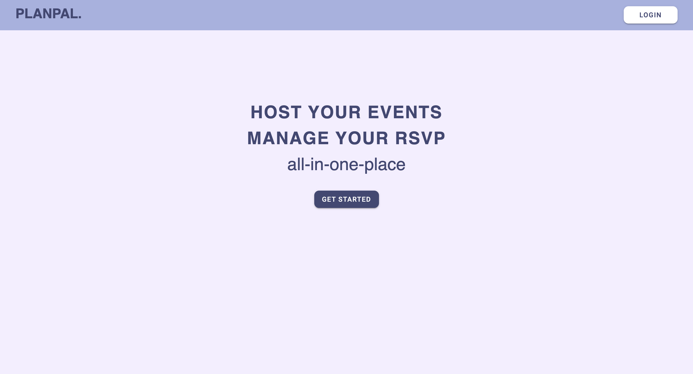

### Login and Registration

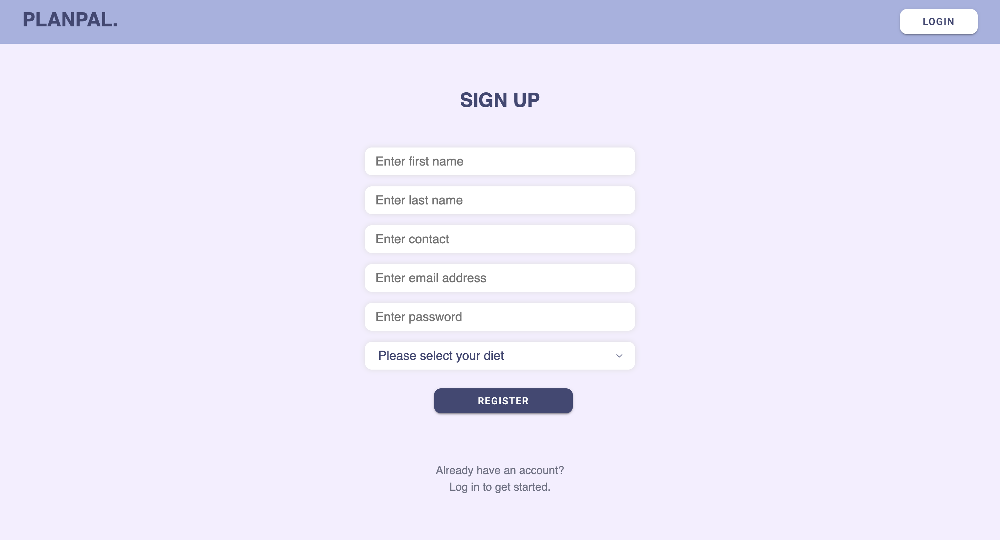
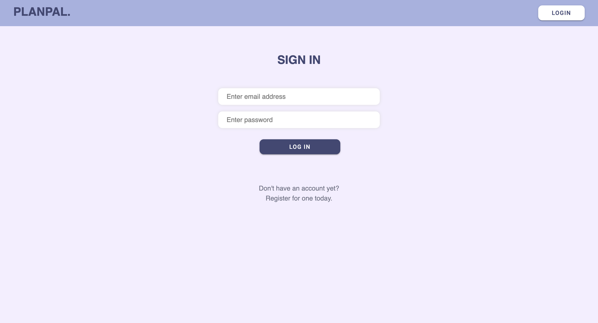

### Dashboard for all users

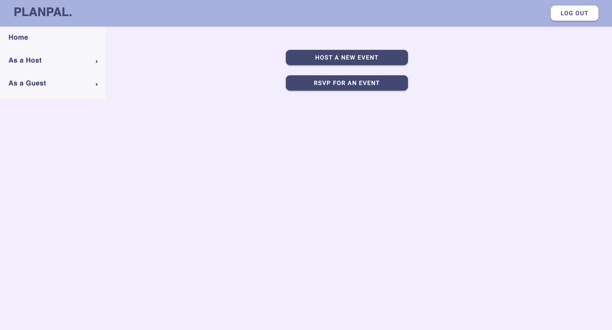

### For hosts

#### Event Creation

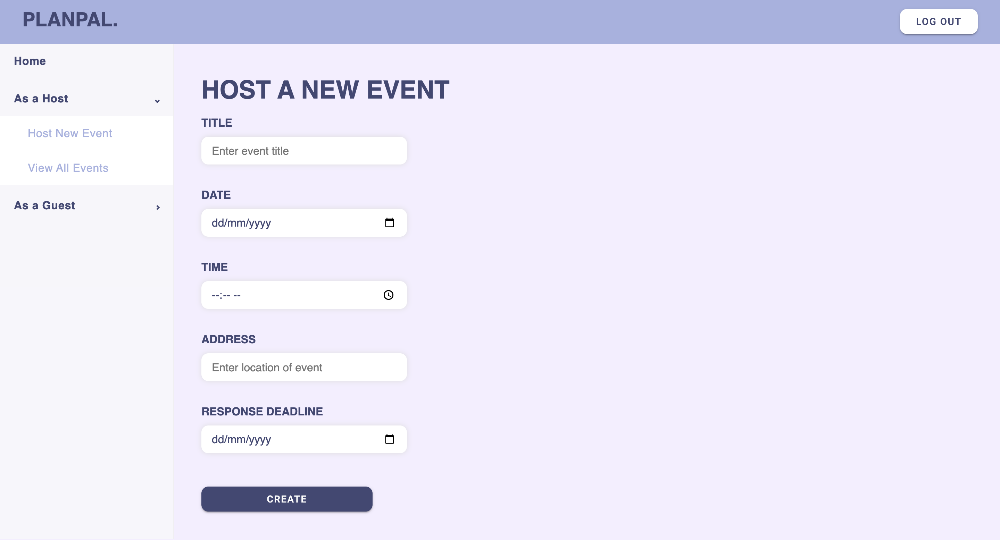

#### View All Events Created By Host

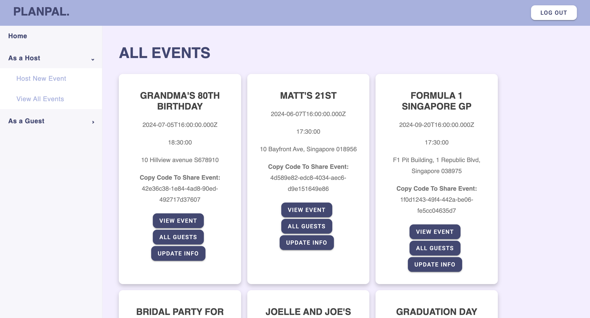

#### View Guestlist

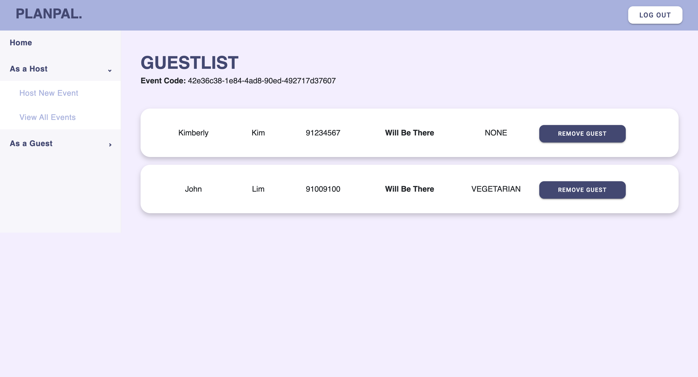

#### Update Event Details

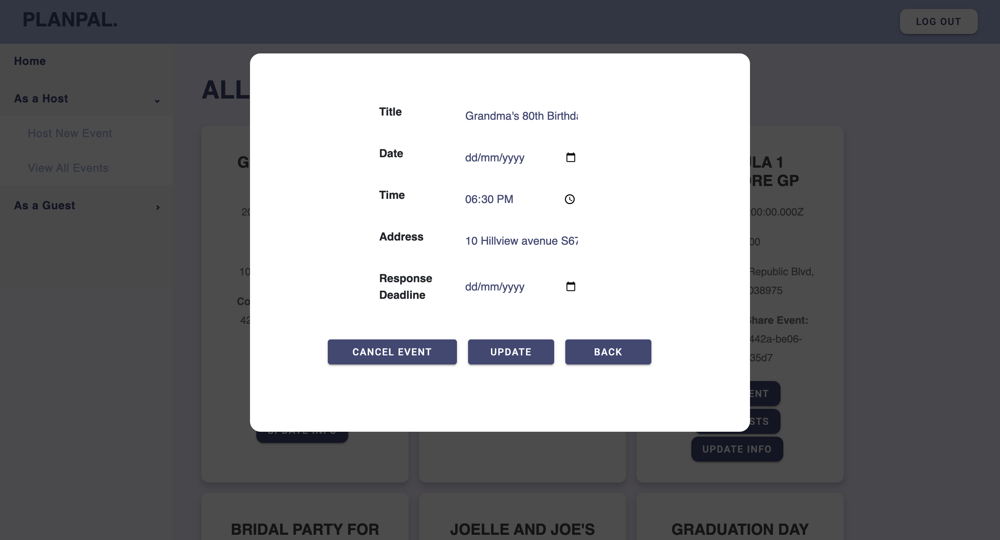

### For guests

#### Search for event by event code (id)

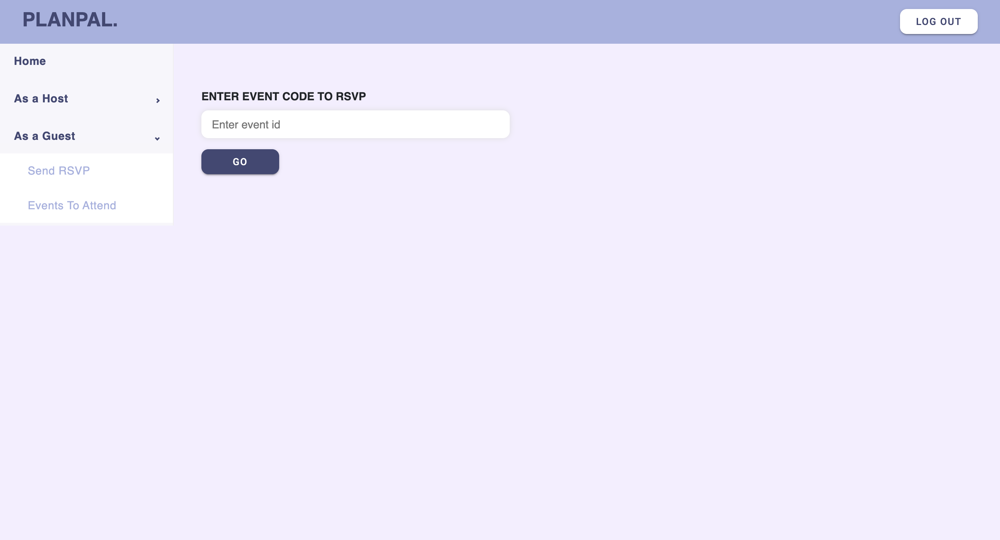

#### Event RSVP Page

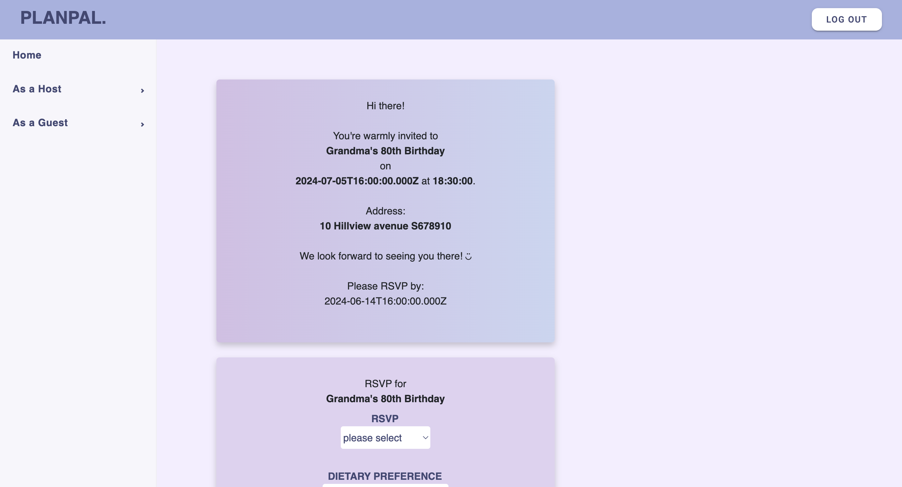

#### View All Upcoming Events For Guest

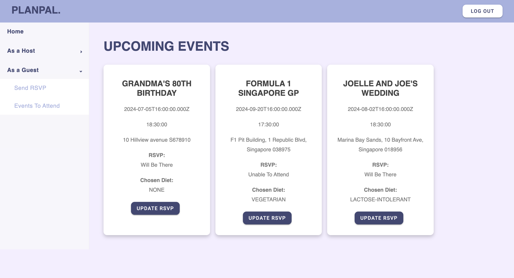

## Technologies Used

- HTML
- CSS
- JavaScript
- Express.js
- Node.js
- React
- PostgreSQL (raw SQL with pg-admin library)

## Future Enhancements

- Allow users to sync up wuth Google Calendar or iCS app
- Allow users to pinpoin specifia locations
